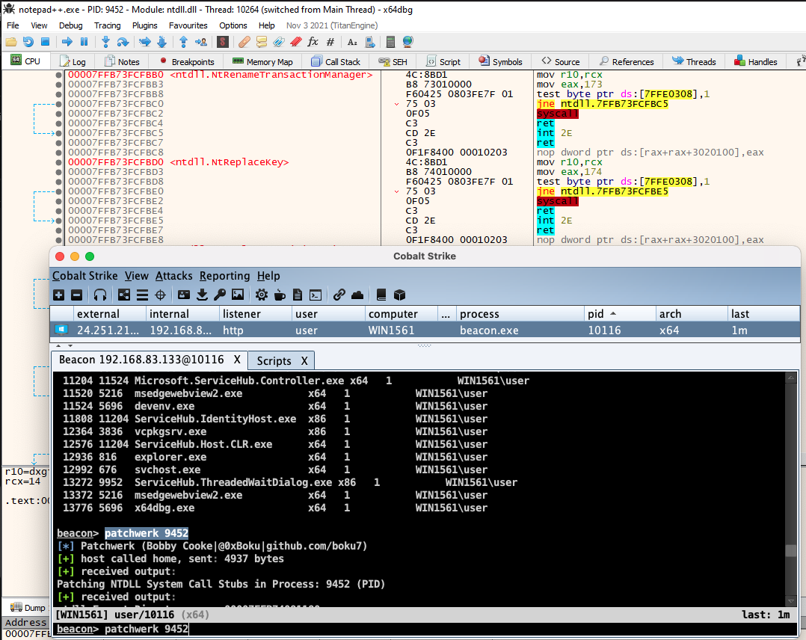
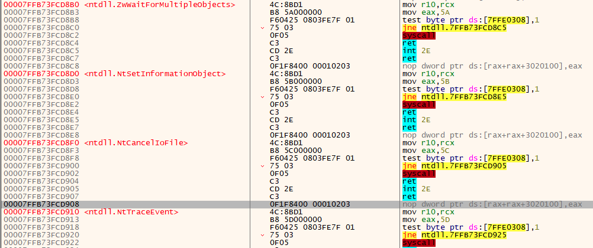

# PatchWerk
This is a PoC for cleaning NTDLL syscall stubs from 3 years ago. The idea was to patch the syscall hooks without opening a handle to ntdll. Project as is, have not tested recently.

Cobalt Strike BOF that finds all the `Nt*` system call stubs within `NTDLL` and overwrites the memory with clean stubs (user land hook evasion). This way we can use the `NTAPI`s from our implant code, and if EDR check the call stack it will have originated from `NTDLL`. It’s pretty much the same as the original unhook by Raph Mudge, but this way there's no need to map `ntdll.dll` from disk or open handles to remote processes.
+ Uses `HellsGate` & `HalosGate` to call direct syscalls for `NtOpenProcess`, `NtWriteVirtualMemory`, and `NtProtectVirtualMemory`.
+ Has custom `GetModuleHandle` & `GetProcAddress` (`getSymbolAddress`) written in C and ASM to evade hooks on `kernel32`.
+ If patching table of current process, does not use `NtOpenProcess`. Just uses `hProc = (HANDLE)-1;` instead.


## Usage
```
beacon> patchwerk 6115
[*] Patchwerk (Bobby Cooke|@0xBoku|github.com/boku7}
[+] host called home, sent 4937
[+] received output:
Patching NTDLL System Call Stubs in Process: 6115 (PID)
...
```
- Run `patchwerk` without the PID to patch current process

## Demo
Running `patchwerk 311`, where `311` is the PID of a remote process, will patch ntdll of the remote process.


+ I put the `01 02 03` at the end of the stubs just to show that it works
